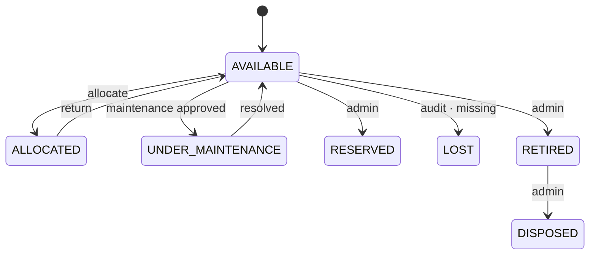

# AssetFlow

**Enterprise Asset & Resource Management System** — track, allocate, and maintain physical assets and shared resources on one platform.


> Built for the **Odoo Hackathon 2026**. AssetFlow replaces spreadsheets and paper logs with structured asset lifecycles, conflict-free allocation and booking, an approval-driven maintenance board, and structured audit cycles — with role-based access enforced throughout.

---

## ✨ Highlights

- **Four enforced business rules** (not just CRUD) — double-allocation block, booking-overlap rejection, maintenance state machine, audit discrepancy — each with data-layer guarantees.
- **Real RBAC** — four roles gated **server-side** in every API route, not just hidden in the UI.
- **Hardened auth** — strong password policy, bcrypt cost 12, timing-safe login, email normalization.
- **10 complete screens** matching the provided mockup, light **and** dark mode.
- **Polish**: ⌘K command palette, per-asset QR codes, toast feedback, live notification badge, CSV/report export.

---

## 🚀 Quick start

### Option A — Docker (one command)

```bash
docker compose up --build
# → http://localhost:3000  (migrations + demo data run automatically)
```
Postgres runs inside the compose network (no host port), so it won't clash with a local Postgres.

### Option B — Local

```bash
npm install
cp .env.example .env          # set DATABASE_URL + AUTH_SECRET (npx auth secret)
npm run db:migrate            # apply schema
npm run db:seed               # load demo data
npm run dev                   # http://localhost:3000
```

### Demo accounts

| Role | Email | Password |
|------|-------|----------|
| Admin | `admin@assetflow.com` | `admin123` |
| Asset Manager | `manager@assetflow.com` | `manager123` |
| Department Head | `head@assetflow.com` | `head123` |
| Employee | `priya@assetflow.com` | `employee123` |

> New signups always create an **Employee** account — elevated roles are assigned only by an Admin in Organization Setup. (Demo passwords are intentionally simple; the signup **policy** requires 8+ chars with mixed case and a number.)

---

## 🧩 Screens

| # | Screen | # | Screen |
|---|--------|---|--------|
| 1 | Login / Signup | 6 | Resource Booking |
| 2 | Dashboard | 7 | Maintenance (Kanban) |
| 3 | Organization Setup | 8 | Audit |
| 4 | Assets Registry | 9 | Reports & Analytics |
| 5 | Allocation & Transfer | 10 | Notifications & Activity Log |

---

## 🔒 Core business rules

The interesting logic lives in `lib/services/` — testable, commented, not buried in UI handlers.

- **Double-allocation block** (`allocation.ts`) — a held asset can't be re-allocated directly; the system forces a **transfer request → approval → re-allocation** flow and preserves history. Backed by a partial unique index `one_active_alloc` so it holds even under concurrency.
- **Booking overlap rejection** (`booking.ts`) — half-open `[start, end)` intervals, serialized with `SELECT … FOR UPDATE`: a 9:00–10:00 booking **rejects** 9:30–10:30 but **allows** 10:00–11:00.
- **Maintenance state machine** (`maintenance.ts`) — moving a card to *Approved* flips the asset to `UNDER_MAINTENANCE`; *Resolved* returns it to `AVAILABLE`.
- **Audit discrepancy** (`audit.ts`) — closing a cycle auto-generates a discrepancy report and marks `MISSING` assets as `LOST`.

Asset tags (`AF-0001`) are issued from a Postgres **sequence** — race-free and delete-proof.

---

## 👤 Roles (RBAC)

Enforced server-side in `lib/rbac.ts` via `can(role, action)`.

| Action | Admin | Asset Mgr | Dept Head | Employee |
|--|:--:|:--:|:--:|:--:|
| Organization setup | ✅ | | | |
| Register / edit assets | ✅ | ✅ | | |
| Allocate asset | ✅ | ✅ | ✅¹ | |
| Approve transfer request | ✅ | ✅ | ✅¹ | |
| Approve return | ✅ | ✅ | | |
| Approve maintenance | ✅ | ✅ | | |
| Raise maintenance · book · request transfer | ✅ | ✅ | ✅ | ✅ |
| Create / close audit cycle | ✅ | | | |
| Org-wide analytics | ✅ | | | |

¹ within their own department

---

## 🔁 State machines



- **Transfer:** `REQUESTED → APPROVED | REJECTED`
- **Maintenance:** `PENDING → APPROVED → TECHNICIAN_ASSIGNED → IN_PROGRESS → RESOLVED` (or `REJECTED`)
- **Booking:** `UPCOMING → ONGOING → COMPLETED` (derived at read time) or `CANCELLED`
- **Audit:** `OPEN → CLOSED` (locked)

---

## 🛡️ Security

- **Password policy** (shared client + server schema in `lib/validation.ts`): 8+ chars, upper + lower + number, capped at bcrypt's 72-byte limit.
- **Hashing**: bcrypt cost factor **12**, centralized in `lib/password.ts`.
- **Timing-safe login**: a dummy hash is compared when an email doesn't exist, so response time can't be used to enumerate valid accounts.
- **Email normalization**: trim + lowercase on signup and login.
- **No self-elevation**: signup can only create an Employee.
- **Department scoping**: a Department Head can only allocate / approve transfers for assets in their own department (Admin & Asset Manager act org-wide).
- **Rate limiting** on `/api/auth/*` (login + signup) to blunt credential stuffing and signup spam.
- **Audit trail**: successful sign-ins are written to the activity log; failed attempts are security-logged.
- **Enumeration-safe signup**: the response never reveals whether an email is already registered.

---

## 🎁 Bonus features

- **⌘K command palette** — global search over assets, people, and departments.
- **QR codes** — every asset detail shows a scannable QR that opens the asset.
- **Dark mode** — system-aware, toggle in the sidebar.
- **Toasts** — inline success/error feedback (no `alert()`).
- **Live notification badge** on the sidebar.
- **CSV export** on reports.
- **One-command Docker** setup.

---

## 🏗️ Tech stack & structure

**Next.js 16** (App Router, TS) · **PostgreSQL + Prisma 6** · **Auth.js v5** (JWT, RBAC) · **Tailwind v4** · **Recharts** · **Zod**

```
prisma/         schema.prisma + seed + migrations
lib/            db client, auth (auth.ts/auth.config.ts), rbac, validation, password
lib/services/   business rules — allocation, booking, maintenance, audit, assets, notifications
app/(auth)/     login & signup
app/(app)/      the 10 authenticated screens (shared sidebar shell)
app/api/        route handlers (RBAC-checked)
components/     shared UI + per-feature components
```

---

## 👥 Team

- **Divyang Kuntar** — foundation, auth, dashboard, maintenance, notifications, bonus features
- **Vishvam** — organization setup, assets, resource booking
- **Miral** — allocation & transfer, audit, reports

---

<sub>The provided Excalidraw mockup contained several typos (e.g. "Recent Acivity", "Electorincs", inconsistent tag formats); these were intentionally corrected in the implementation.</sub>
